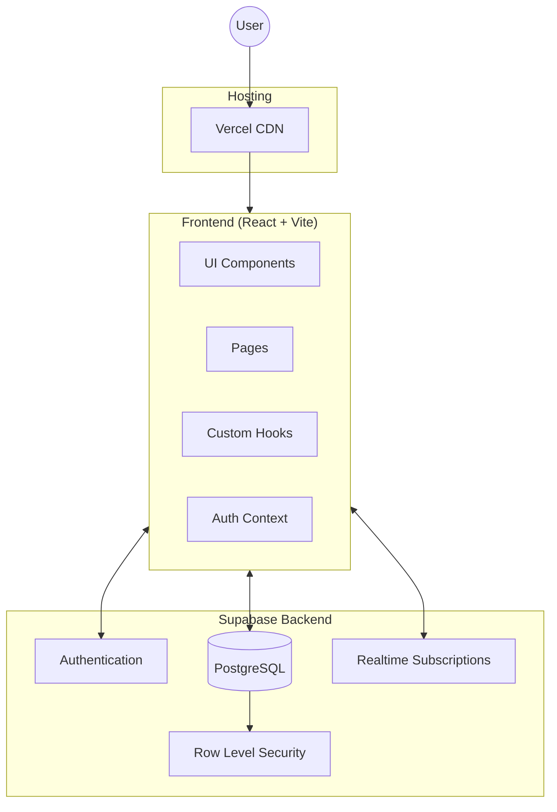
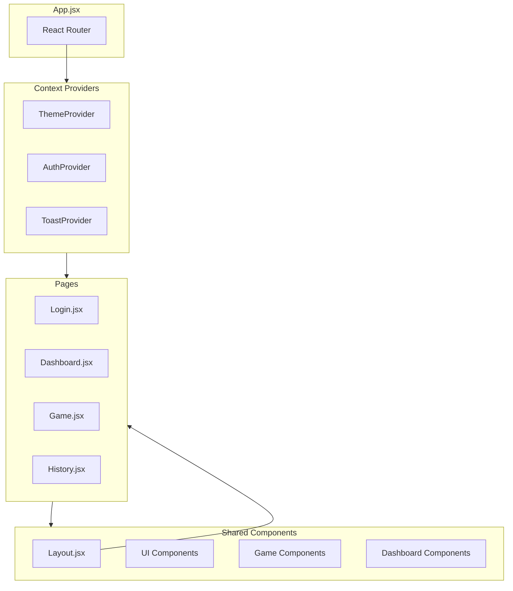
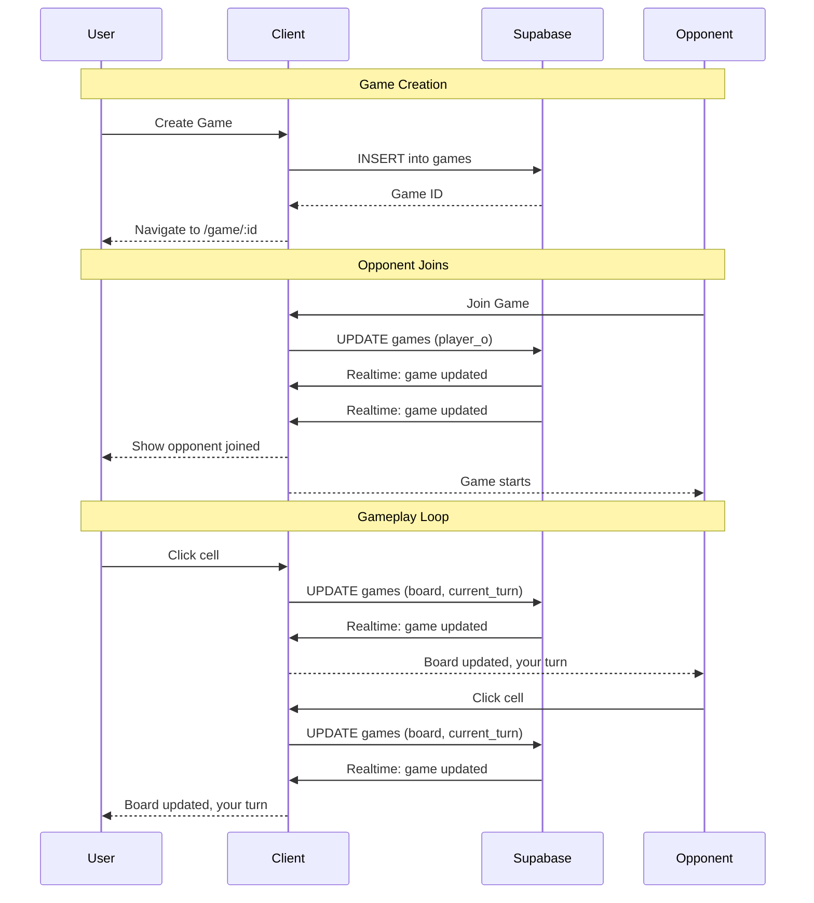
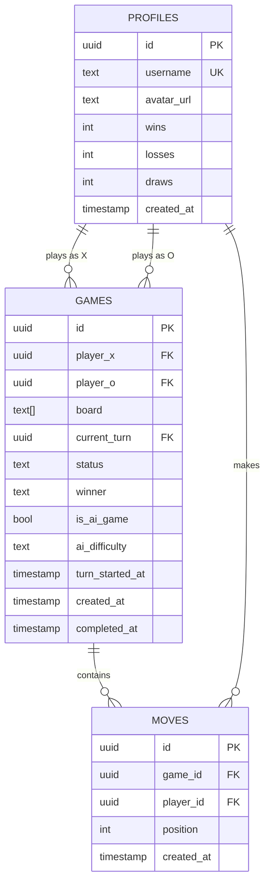
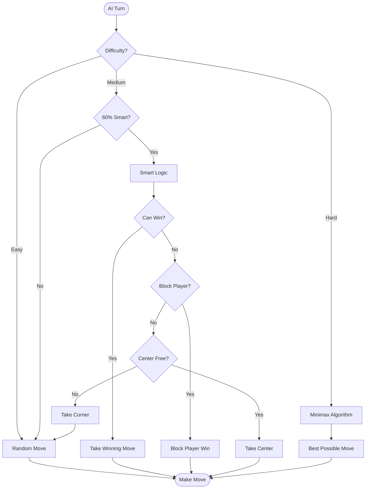
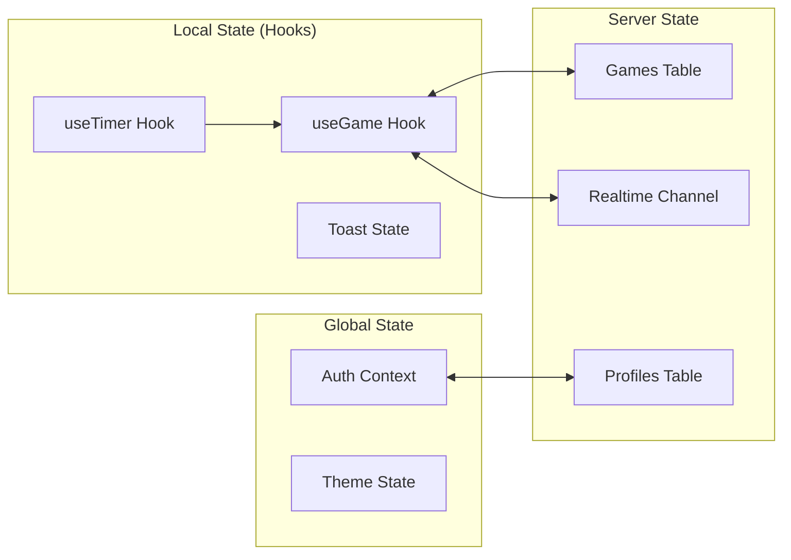
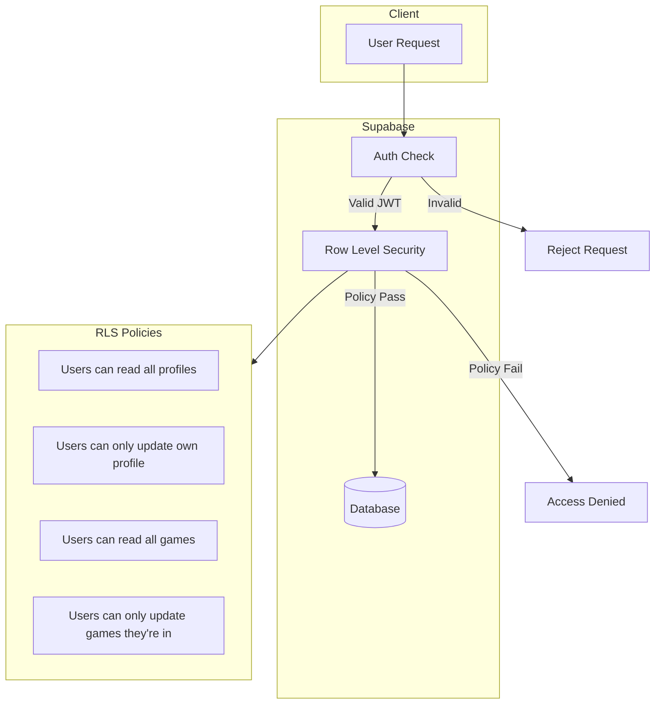

# Architecture

## System Overview



## Component Architecture



## Data Flow



## Database Schema



## AI Decision Tree



## State Management



## File Structure

```
src/
├── components/
│   ├── ui/                 # Reusable UI primitives
│   │   ├── Button.jsx
│   │   ├── Card.jsx
│   │   ├── Input.jsx
│   │   ├── Avatar.jsx
│   │   ├── Badge.jsx
│   │   ├── Timer.jsx
│   │   └── Toast.jsx
│   ├── game/               # Game-specific components
│   │   ├── Board.jsx
│   │   ├── Cell.jsx
│   │   ├── GameStatus.jsx
│   │   └── WinOverlay.jsx
│   ├── dashboard/          # Dashboard components
│   │   ├── GameList.jsx
│   │   ├── GameCard.jsx
│   │   └── StatsCard.jsx
│   ├── Layout.jsx
│   └── ThemeToggle.jsx
├── pages/
│   ├── Login.jsx
│   ├── Dashboard.jsx
│   ├── Game.jsx
│   └── History.jsx
├── hooks/
│   ├── useGame.js          # Game state & Supabase sync
│   └── useTimer.js         # Turn countdown timer
├── context/
│   └── AuthContext.jsx     # Authentication state
├── lib/
│   ├── supabase.js         # Supabase client
│   ├── gameLogic.js        # Win detection, AI algorithms
│   └── utils.js            # Utility functions (cn)
├── App.jsx                 # Routes & providers
├── main.jsx                # Entry point
└── index.css               # Tailwind & global styles
```

## Security Model


